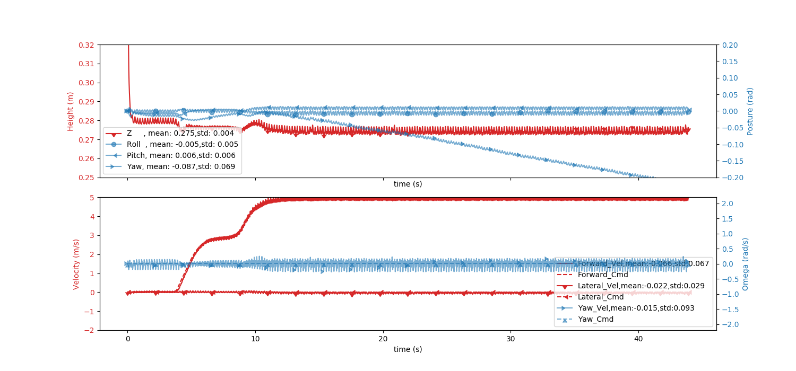
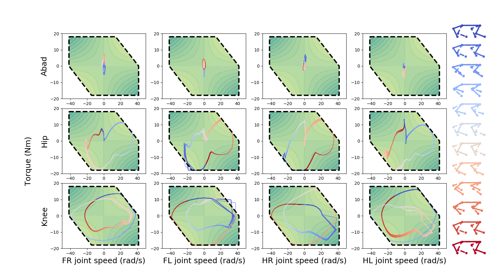

# High-Speed Quadrupedal Locomotion by Imitation-Relaxation Reinforcement Learning

The IRRL learning paradigm is mainly to reduce the difficulty of designing the cost function of a robot controller based on the reinforcement learning method. Inspired by Deepmimic, Motion imitation can guide the neural network controller to rapidly converge to the local optimal solution, to realize bionic and periodic gait. Based on this solution, remove the mimic reward to guide the controller to fit robot's own dynamics for better performance. Based on hyperplane analysis, motion imitation can guide RL to jump over the local optima, and relaxation learning can further exploit the potential of the robot system.

-------------------

## Installation Guide

-------------------

### Prerequisites

-------------------

- OS support: Ubuntu(16.04 is tested)
- Python version: 3.5

### Dependencies

-------------------
| Software/Package | Version |
|:--:|:--:|
| [Raisim](https://raisim.com/) | \>=1.0.0 |
| [raisimogre](https://github.com/raisimTech/raisimOgre) | - |
| numpy | - |
| [stable-baselines](https://github.com/Stable-Baselines-Team/stable-baselines) | 2.8.0 |
| Matplotlib | - |

### Tips during installation and compile

Change the package location in CMakeLists.txt file according to corresponding package installation config  

For example:  

```CMakeList
set(pybind11_DIR ~/raisim_build/share/cmake/pybind11)
set(raisimOgre_DIR ~/raisim_build/share/raisimOgre/cmake)
set(OGRE_DIR ~/raisim_build/lib/OGRE/cmake)
```

To install the reinforcement learning environment, just run:

```shell
cd ./IRRL/FlexibleRobotRaisimGym/
sh compile.sh
```

## Usage

- To run the pretrained LSTM controller:
Connect xbox gamepad to the computer to control the robot for test. Left analog stick controls the forward and lateral velocity command, right analog stick controls the rotation velocity. Press the start button to finish the test and plot the figures for some physics variables (with matplotlib).

```shell
cd ./IRRL/script
python3 run_bp_v5.py --test --cfg ./config/bp5_test.yaml --model ./pkl/bp5_155.pkl --eval --wc
```

e.g.
<center>


</center>

- To train a LSTM controller for quadrupedal robots:

```shell
cd ./IRRL/script
python3 run_bp_v5.py --train --l 0.001 --max_iter 200000000
```

- To relax a pretrained controller:

```shell
python3 run_bp_v5.py --train --l 0.0005 --max_iter 400000000 --load ./pkl/bp5_155.pkl
```

<!-- - To change the reward shape, tunning the parameter in default.yaml configuration file. -->
- To tune the reward function, change the parameter in `default.yaml` configuration file.

-------------------

## Data

We put the data used in this article in the [Exp_Raw_Data folder](./Exp_Raw_Data/)

-------------------

## Analysis and post-processing

The post-processing code for Figure 2,3,4,5 is added in [Data_Visualization_Code](./Data_Visualization_Code/)

run the corresponding code to the the corresponding picture

-------------------

## Reference

- [RaisimGym](https://github.com/leggedrobotics/raisimGym)
- [DeepMimic](https://github.com/xbpeng/DeepMimic)

## License

This project is covered under the MIT License.
